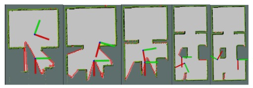
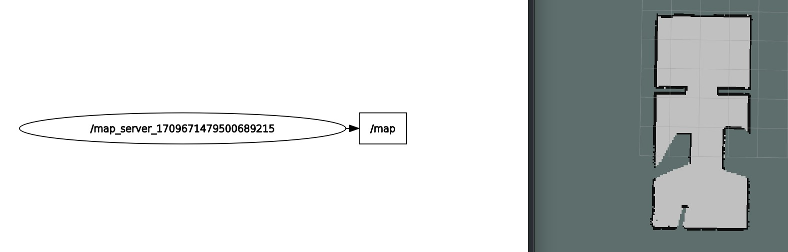
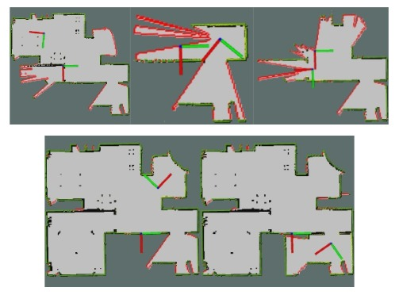
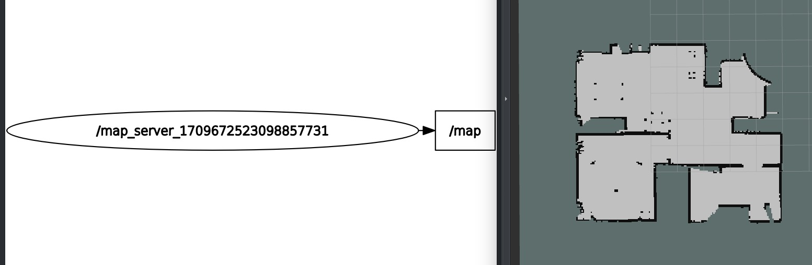

# ROS-1-GAZEBO-EXPLORATION
Este es un workspace de ROS donde donde objetivo principal es desarrollar un algoritmo de exploración autónoma utilizando un robot en un entorno desconocido.

### AUTORES:

**- Fernando Vela Hidalgo (GitHub: [github.com/fervh](https://github.com/fervh))**

**- Javier Gómez Eguizábal (GitHub: [github.com/Javierge15](https://github.com/Javierge15))**

**- Alberto Gil Cuadrado (GitHub: [github.com/Alberto-gca](https://github.com/Alberto-gca))**

<p align="center">
  
</p>

Este proyecto es parte de la asignatura "Robots Móviles" en la Universidad Carlos III de Madrid (UC3M).

----
## PUESTA EN MARCHA DEL ALGORITMO Y ENTORNOS

### Reqiere Ubuntu 20.04 con ROS Noetic

En la Terminal 1:
```bash
roslaunch ros_autonomous_exploration moviles.launch
```

En la Terminal 2:
```bash
rosrun ros_autonomous_exploration map_save_node.py
```

En la Terminal 3:
```bash
rostopic echo /porcentaje_borde
```


<p align="center">
  
</p>


Si da algún error prueba a ejecutar el siguiente comando desde terminal:
```bash
sudo apt-get install ros-noetic-dwa-local-planner
```

----

## ALGORITMO DE EXPLORACIÓN
Tanto el el algoritmo de exploración como el criterio de parada se encuentra en un sistema diseñado de manera modular, por lo que el código se encuentra dividido en cuatro scripts en los que cada uno realiza una función primordial dentro del algoritmo. Estos scripts son los siguientes:


### exploration_node
[exploration_node](exploration_node.py)
Utiliza el paquete move_base para enviar metas de navegación al robot implementado.

### porcentaje_borde_node
[porcentaje_borde_node.py](porcentaje_borde_node.py)
Determina cual es el porcentaje de exploración del mapa. Crea listas para almacenar los puntos del borde del mapa y mensajes de nube de puntos para cada tipo de celda.

### target_point_node
[target_point_node](target_point_node.py)
Procesa el mensaje de nube de puntos del nodo anterior y determina el punto medio de esta, hacia donde se dirigirá posteriormente el robot.

### map_save_node
[map_save_node](map_save_node.py)
Comprueba el criterio de parada, guarda el mapa y detiene todos los procesos. La llamada a este código determina el final de la ejecución del algoritmo.


----

## CRITERIO DE PARADA 

En el momento que el porcentaje del borde en contacto con obstáculos supera el deseado y determinado en el código con respecto al borde en contacto con zona inexplorada se asume el mapa como completado, se guarda y se detienen todos los procesos. Para cada caso se puede definir el porcentaje deseado. En este caso se ha determinado un porcentaje mínimo del 80%

----

## RESULTADOS OBTENIDOS
### ENTORNO 1
- ### Mapa
  Capturas del proceso de mapeado
  <p align="center">
    
  </p>
  Una vez completado, el mapa se presenta de la siguiente manera:
  <p align="center">
    
  </p>

- ### Tiempo de exploracion
  El tiempo de exploración del mapa es de 33 segundos. El proceso se puede ver en el siguiente video:
  [escenario1.webm](https://github.com/fervh/ROS-1-GAZEBO-EXPLORATION/assets/55854056/d970587c-2e94-408a-9040-90e5184a3983)
- ### Porcentaje de zona explorada

  Se alcanza para este mapa un porcentaje de exploración del 95%.

### ENTORNO 2
- ### Mapa
  Capturas del proceso de mapeado
  <p align="center">
    
  </p>
  Una vez completado, el mapa se presenta de la siguiente manera:
  <p align="center">
    
  </p>

- ### Tiempo de exploracion
  El tiempo de exploración del mapa es de 3 minutos y 50 segundos. El proceso se puede ver en el siguiente video de forma acelerada:
  [escenario2.webm](https://github.com/fervh/ROS-1-GAZEBO-EXPLORATION/assets/55854056/70e7e5ba-62ca-4ea8-b854-515ec065cf7c)

- ### Porcentaje de zona explorada

  Se alcanza para este mapa un porcentaje de exploración del 85%.
  
### ENTORNO 3
- ### Mapa
Capturas del proceso de mapeado

- ### Tiempo de exploracion
El tiempo de exploración del mapa es de 2 minutos y 55 segundos. El proceso se puede ver en el siguiente video de forma acelerada:
[escenario3.webm](https://github.com/fervh/ROS-1-GAZEBO-EXPLORATION/assets/55854056/8087233f-e98f-4f4a-9c0e-0cacd7027fd0)
- ### Porcentaje de zona explorada

Se alcanza para este mapa un porcentaje de exploración del 80%.

### ENTORNO 4
- ### Mapa
- ### Tiempo de exploracion
- ### Porcentaje de zona explorada


## VIDEOS
